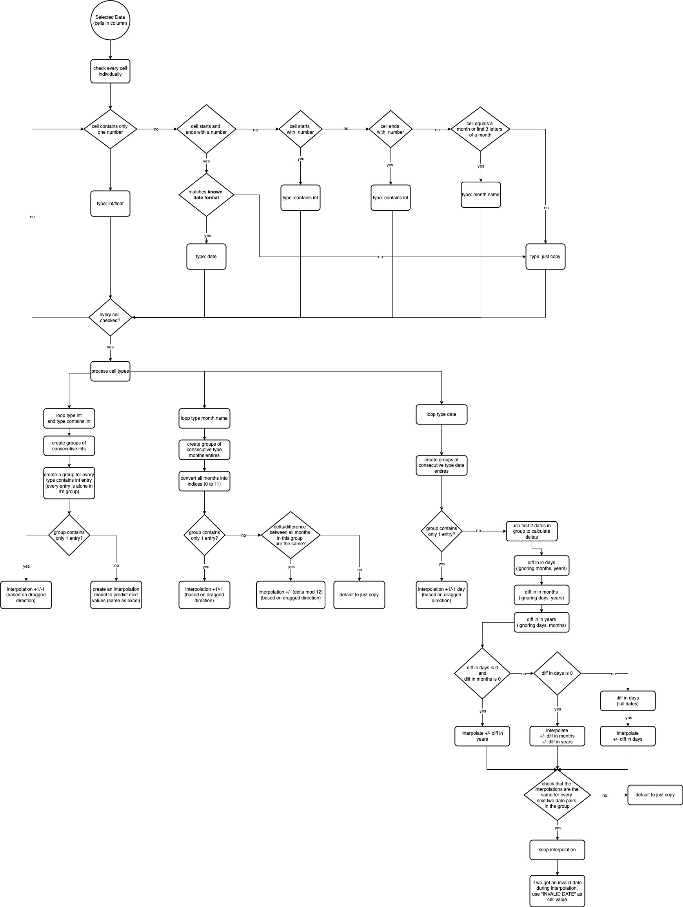

# vscode-edit-csv

This extensions allows you to edit csv files with an excel like table ui

## Web version

If you don't have vs code to hand, you can use the online version at https://edit-csv.net

## Features

Execute the command `edit as csv` to open an editor for the current file.

*Execute the command again to switch back to the source file or to switch back to the editor*


**Note that the data flow is one way (editor to source file). If you make changes to the source file (.csv) while the editor is open, the editor will not be updated!**

## ¡ Important Notes !

- On initial load all rows are expanded so that all rows have equal length (number of cells (if necessary))
	- if that happens you will see the `unsaved changes` indicator right from the start

- enabling/disabling the `has header` read option will **clear the undo/redo stack!**

- empty lines are skipped!
	- this will not trigger the `unsaved changes` indicator
	- (during parsing) a row is also empty when it only contains `""`
		- this can be problematic if you have only 1 column...

- We try to retain quote information (default) but in *some cases* fields could get unquoted on save (see [Retain Quote Information Rules](##retain-quote-information-rules))

- Comment row (rows starting with a comment) will only export the first cell
	- if you accidentally added comment text to a cell other than the first cell you will notice it (color)

- Adding new lines to comments rows (via alt + enter) will have no effect when exporting (lines breaks are removed in comments!)
	- leading spaces will be removed in comment rows!

- Starting with Version **0.1.0** the table has a context menu (right-click the table)
	- *(just mentioning it because it is not obvious via the ui)*

- Plugin Version **0.0.11** had an issue with loading and saving files with more than \~1 MB
	- saved files were corrupted (content of the first \~1MB was repeated after the first \~1MB until the file size was reached)

## Retain Quote Information Rules

during parsing information about the quotes are stored

- quote information is only stored for columns
- only the first non-comment, not empty row (no fields) is used to gather quote information
- if the first row has less cells than other rows
	- then missing entries are filled with `csv-edit.newColumnQuoteInformationIsQuoted` (default is not quoted)
- manually added columns will get `csv-edit.newColumnQuoteInformationIsQuoted` quote information
- moving columns will also "move" the quote information
	- e.g. column 3 was quoted and is now column 1 then column 1 is quoted after moving


Implications of this

- columns with mixed cells (quoted and not quoted fields) will get homogeneously quoted


This can be turned off by setting `csv-edit.retainQuoteInformation` to `false`
In this case all unnecessary quotes are removed


## How this extension works

*essentially it's just import csv and export csv*

When you click on `edit csv file`

- the file content is cut into pieced and transferred via `[webview].postMessage`
- the current config is stringified and injected into the editor (webview) html
- a manager stores a reference to the webview, source file uri, editor uri

- in the webview the pieces are put together and the text is parsed as csv and displayed in the (handsontable) table element

When you click on `apply`

- the current table is transformed into csv, transferred via `vscode.postMessage` to the extension and written to the source file
	- if you clicked on `apply` by accident, you can undo the changes in the table element (with the usual shortcuts) and apply again or open the source file and just do an undo (with the usual shortcuts)

- When you click on `apply and save`
	- the first step is equal to `apply`
	- then the source file is saved


- When you click in `Read again`
	- the injected content is used (when the editor was opened), this does not read the source file again

As you can see this **does not** scale very well with **large csv files** (needs to be stringified and stored the whole time)

## Drag to Auto Fill

Starting from version `0.10.0` the setting `dragToAutoFill` defaults to `excelLike`.

The other values are `none` and `copyOnly`.

`none` is used to disable auto fill.

Setting `dragToAutoFill` to `copyOnly` will copy the selected cell values over and over again.
Example: `1,b,3` and you drag the handle 6 cells further will give `1,b,3,1,b,3` as auto fill values.
As you can see, there is no interpolation, the selected sequence is copied over and over.

The default setting `excelLike` will mimic the excel behavior for auto fill values.

It will *just work* most of the time, however, there could be some edge cases.

Generally, the following values can be auto filled: numbers, month names and dates.

For a full explanation on how the auto fill actually works, scroll down to the [explanation](#excel-like-auto-fill-behavior)

## Extension Settings

There are some settings for this plugin. Open the VS Code Settings and search for `csv-edit`

### Supported file types/extension

Files with the extension `.csv`, `.tsv` should work out of the box.

You can change the file type in the bottom right corner of the editor (select language mode). This is required for unnamed/new files.

For `tsv`, make sure the indention is set to `tabs`.

### File extension xyz is not recognized by the vs code extension

See https://code.visualstudio.com/docs/languages/overview#_adding-a-file-extension-to-a-language

If the link is down: Search for `files.associations` in the vs code settings. Then add an entry for `*.xyz` to `csv`.  
Now the file is treated as a csv file and is recognized by the extension

## Known Issues

- `apply and save` an unnamed file will close the editor
	- this is because the new uri for the new file is not known and for some reason if an extension saves an unnamed file the new file is not displayed automatically
		- maybe this can be resolved when https://github.com/Microsoft/vscode/issues/43768 is closed

- renaming a file while an editor is open for that file will break the reference the the source file
	- thus changes can no longer be saved/applied
	- maybe this can be resolved when https://github.com/Microsoft/vscode/issues/43768 is closed

- if the source file content changes and the file is not in the current workspace (open folder) auto file content reload is not working
	- however, you are notified if the file content changes (e.g. outside of vs code)

## Alternatives

I recommend installing the `Rainbow CSV` extension, the extensions play well together!

*If you want to only view csv files you can go for the extension [Excel Viewer](https://marketplace.visualstudio.com/items?itemName=GrapeCity.gc-excelviewer). It has some more advanced sorting and filtering features.*

## How long will it stay in preview?

There is one things missing...

- tests
	- especially for interaction between vs code and the webview
	- I added some listeners to handsontable hooks which manipulate rendering, selection...

## Why not...?

- use merged cells for comments (rows)
	- there are some problems with adding/removing rows in connection with undo & redo, sorting...
- update handsontable to 7.x.x
	- with version 7 handsontable is only free for non-commercial use

## Used projects

- for csv parsing/writing: [papaparse](https://github.com/mholt/PapaParse)
	- with small custom modifications to handle comments specially
- for grid/table element: [handsontable](https://github.com/handsontable/handsontable)
- for ui: [vs code webview-ui-toolkit](https://github.com/microsoft/vscode-webview-ui-toolkit), [fontawesome](https://github.com/FortAwesome/Font-Awesome)
- for shortcuts: [mousetrap](https://github.com/ccampbell/mousetrap)
- for big numbers: [big.js](https://github.com/MikeMcl/big.js)
- for auto fill
  - [regression-js](https://github.com/Tom-Alexander/regression-js)
  - [day.js](https://day.js.org/en/) for date handling
  - (big.js for numbers)

*see `thirdParty` folders*

There are some more in `package.json`. Even if they are not referenced directly, they are used e.g. for the browser build. We copy them from `node_modules` into the `thirdParty` folders.

## Open the editor from other (your) extension with custom settings

There is a command `edit-csv.editWithConfig`. It can be used to open the editor with settings specified by you.

All possible settings can be found in `[project root]/csvEditorHtml/types.d.ts > EditCsvConfig`. The easiest way is to copy both types `EditCsvConfig` and `EditCsvConfigOverwrite` and then call the extenion command like this:

```ts
 vscode.commands.registerCommand('yourExtension.yourCommand', () => {
	let overwriteSettings: EditCsvConfigOverwrite = {
		readOption_hasHeader: "true",
		//other options, auto completion enabled
	}

	vscode.commands.executeCommand(`edit-csv.editWithConfig`, overwriteSettings)
})
```

There is one problem left: the `Edit csv` button in the title bar (and the file right click menu action) will still use the settings set by the user...
For this there is the option `csv-edit.hideOpenCsvEditorUiActions`. If set to true it will hide the two ui actions. This way you can create a buttom from your extension and open the editor and force your settings.

**Make sure to keep the type EditCsvConfig up-to-date (in case any types change)**

The extension will warn you about any unknown settings supplied but will not check the actual property values!

It will overwrite the settings configured by the user and call the same method as `edit-csv.edit` (the default when the editor is opened via the `Edit csv` button).

## How to build locally

To compile (and watch) the files in `csvEditorHtml` run

```bash
tsc -w #or just tsc to transpile only once
# new terminal
cd csvEditorHtml
tsc -w #or just tsc to transpile only once
```

then press `F5` to run the extension

When you edit `csvEditorHtml/index.html` you need to manually copy the changes (everything in the body but without the scripts) into `src/getHtml.ts` (past into body)

You can also open `csvEditorHtml/index.html` in your favorite browser and play around *(the vs code settings are not applied in the browser)*

## License

Code: MIT

---

### Excel like Auto Fill Behavior

I tried my best to replicate excel auto fill from observations...

The selected values are grouped into consecutive sequences if possible.
These groups are then used to determining the interpolations.

e.g. `2,4,a` will create the groups `2,4` and `a`.
Then `2,4` is used to interpolate the next values (`6,8,10,...`),
while `a` ist just copies over and over

e.g. `2,4,a,01.01.2024,03.01.2024` will create the groups `2,4`, `a` and `01.01.2024, 03.01.2024`

Again, `2,4` is used to interpolate the next numbers,
`a` is just copied
`01.01.2024,03.01.2024` is used to interpolate the next dates `05.01.2024, 07.01.2024, 09.01.2024, ...`


Creating groups allows to still interpolate, even if heterogenous data is selected.

However, consecutive sequences must have the same *delta* in order to be a proper sequence.

For numbers, linear regression can always fit a line but for month names and dates no *model* is used.

This means if distance between 3 month names in the sequences is different, auto fill will fallback to just copying the sequence over and over again.
Example: `jan,feb,apr` with the distances/deltas of `1,2`. If the deltas are different then it's not clear what the next value should be.

Example: `jan,feb,mar` with the distances/deltas of `1,1`. All deltas are the same, so we can continue with this delta and always add `1` month.

This is also true for dates when the distance in days is used.

Below you will find a flow char explaining the steps taken in greater detail.

#### Numbers

The cell text is a number.

For numbers (floats) the language settings matter, e.g. 3.45 or 3,45
For auto filling numbers the setting `numbers style` from the table ui is taken. It can be found when you open the stats panel on the left (by clicking the arrow next to `add row`).

If you work primarily with one number style, you can change the default via the extension setting `initialNumbersStyle`.

Auto filling numbers uses [linear regression](https://en.wikipedia.org/wiki/Linear_regression) to determine the values to fill (Excel also uses linear regression).


### Contains Number

This is different from normals numbers because here the cell text must start or end with a number (or both).

In this case the interpolation is only `+1/-1`.

if there is a number at the start of the cell, this takes precedence.


#### Dates

For dates the following formats are supported/known:

- `YYYY-MM-DD`
- `YYYY-M-DD`
- `YYYY-MM-D`
- `YYYY-M-D`
- `DD-MM-YYYY`
- `DD-M-YYYY`
- `D-MM-YYYY`
- `D-M-YYYY`
- `DD-MM-YY`
- `DD-M-YY`
- `D-MM-YY`
- `D-M-YY`

where `YY/YYYY` stands for the year, e.g. 24/2024, `M/MM` stands for the month, e.g. 5/05 and `D/DD` stands for the day, e.g. 5/05

The separator `-` can actually be one of the following: `- / .`

**Yes**, there is no `MM-DD-YYYY` format!


For the interpolation only the first two selected dates are used (to determine the delta).

Then the diff in `days`, `months` and `years` is calculated, ignoring the other parts of the date.
e.g. the diff/delta in days for `25.05.2024` - `26.07.2024` is still only 1 `day`

when the diff in `days` is 0 and diff in `months` is 0, use the diff in years for interpolation
this ensures days and months will stay the same: `25.05.2024, 25.05.2026` -> `25.05.2028`

when only the diff in `days` is 0, use the diff in month and days for interpolation
e.g. `25.05.2024, 25.07.2026` -> `25.09.2028`

in any other case use the diff in `days` but this time respecting all parts of the date as delta for interpolation
e.g. `01.01.2024, 02.02.2024` gives a delta of 32 `days`
and the next date will be `05.03.2024`

if there are more than 2 dates in the group sequence then they must have the same diff/delta.
if thath is not the case, default to just copying the dates as sequence over and over


#### Month Names

For month names only english names are supported: `january|february|march|april|may|june|july|august|september|october|november|december`
Also the first 3 letters can be used as month names: `jan|feb|mar|apr|may|jun|jul|aug|sep|oct|nov|dec`

In order to auto fill month names, the month name must be the only text in the cell.

#### Differences to Excel

When only 1 cell is selected, interpolation increases

- `+1/-1` for numbers
- next/previous month name
- `+1/-1` day for dates

where excel will just copy the value

There might be other differences...


#### Auto Fill Flowchart

If it's too small, open it from `docs/autoFillDiagram.jpg`

