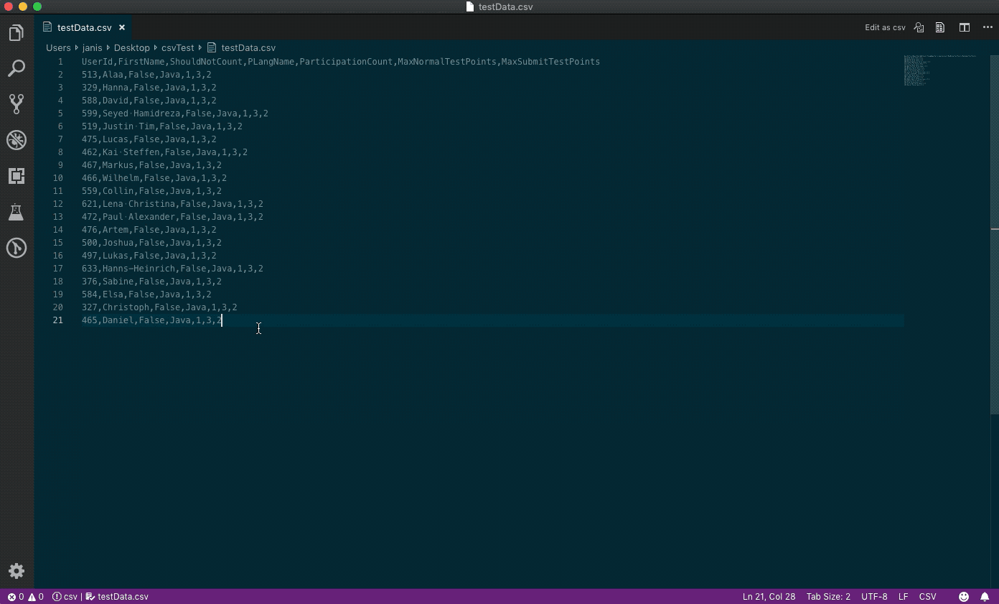

# vscode-edit-csv README

This extensions allows you to edit csv files with an excel like table ui

## Web version

If you don't have vs code to hand, you can use the online version at https://edit-csv.net

## Features

Execute the command `edit as csv` to open an editor for the current file.

*Execute the command again to switch back to the source file or to switch back to the editor*



**Note that the data flow is one way (editor to source file). If you make changes to the source file (.csv) while the editor is open, the editor will not be updated!**

## ¡ Important Notes !

- On initial load all rows are expanded so that all rows have equal length (number of cells (if necessary))
	- if that happens you will see the `unsaved changes` indicator right from the start

- enabling/disabling the `has header` read option will **clear the undo/redo stack!**

- empty lines are skipped!
	- this will not trigger the `unsaved changes` indicator
	- (during parsing) a row is also empty when it only contains `""`
		- this can be problematic if you have only 1 column...

- We try to retain quote information (default) but in *some cases* fields could get unquoted on save (see [Retain Quote Information Rules](##retain-quote-information-rules))

- Comment row (rows starting with a comment) will only export the first cell
	- if you accidentally added comment text to a cell other than the first cell you will notice it (color)

- Adding new lines to comments rows (via alt + enter) will have no effect when exporting (lines breaks are removed in comments!)
	- leading spaces will be removed in comment rows!

- Starting with Version **0.1.0** the table has a context menu (right-click the table)
	- *(just mentioning it because it is not obvious via the ui)*

- Plugin Version **0.0.11** had an issue with loading and saving files with more than \~1 MB
	- saved files were corrupted (content of the first \~1MB was repeated after the first \~1MB until the file size was reached)

## Retain Quote Information Rules

during parsing information about the quotes are stored

- quote information is only stored for columns
- only the first non-comment, not empty row (no fields) is used to gather quote information
- if the first row has less cells than other rows
	- then missing entries are filled with `csv-edit.newColumnQuoteInformationIsQuoted` (default is not quoted)
- manually added columns will get `csv-edit.newColumnQuoteInformationIsQuoted` quote information
- moving columns will also "move" the quote information
	- e.g. column 3 was quoted and is now column 1 then column 1 is quoted after moving


Implications of this

- columns with mixed cells (quoted and not quoted fields) will get homogeneously quoted


This can be turned off by setting `csv-edit.retainQuoteInformation` to `false`
In this case all unnecessary quotes are removed


## How this extension works

*essentially it's just import csv and export csv*

When you click on `edit csv file`

- the file content is cut into pieced and transferred via `[webview].postMessage`
- the current config is stringified and injected into the editor (webview) html
- a manager stores a reference to the webview, source file uri, editor uri

- in the webview the pieces are put together and the text is parsed as csv and displayed in the (handson) table element

When you click on `apply`

- the current table is transformed into csv, transferred via `vscode.postMessage` to the extension and written to the source file
	- if you clicked on `apply` by accident, you can undo the changes in the table element (with the usual shortcuts) and apply again or open the source file and just do an undo (with the usual shortcuts)

- When you click on `apply and save`
	- the first step is equal to `apply`
	- then the source file is saved


- When you click in `Read again`
	- the injected content is used (when the editor was opened), this does not read the source file again

As you can see this **does not** scale very well with **large csv files** (needs to be stringified and stored the whole time)

## Extension Settings

There are some settings for this plugin. Open the VS Code Settings and search for `csv-edit`

### File extension xyz is not recognized by the vs code extension

See https://code.visualstudio.com/docs/languages/overview#_adding-a-file-extension-to-a-language

If the link is down: Search for `files.associations` in the vs code settings. Then add an entry for `*.xyz` to `csv`.  
Now the file is treated as a csv file and is recognized by the extension

## Known Issues

- after reordering columns or rows (e.g. sorting or manually dragged) inserting rows/col won't work (ui gets out of sync with data)

- `apply and save` an unnamed file will close the editor
	- this is because the new uri for the new file is not known and for some reason if an extension saves an unnamed file the new file is not displayed automatically
		- maybe this can be resolved when https://github.com/Microsoft/vscode/issues/43768 is closed

- renaming a file while an editor is open for that file will break the reference the the source file
	- thus changes can no longer be saved/applied
	- maybe this can be resolved when https://github.com/Microsoft/vscode/issues/43768 is closed

- if the source file content changes and the file is not in the current workspace (open folder) auto file content reload is not working
	- however, you are notified if the file content changes (e.g. outside of vs code)

## Alternatives

*If you want to preview csv files you can go for the extension [Excel Viewer](https://marketplace.visualstudio.com/items?itemName=GrapeCity.gc-excelviewer). It has some more advanced sorting and filtering features.*

## How long will it stay in preview?

There are two things missing...

- a pretty icon ;)
- tests
	- especially for interaction between vs code and the webview
	- I added some listeners to handsontable hooks which manipulate rendering, selection...

## Why not...?

- use merged cells for comments (rows)
	- there are some problems with adding/removing rows in connection with undo & redo, sorting...
- update handsontable to 7.x.x
	- with version 7 handsontable is only free for non-commercial use

## Used projects

- for csv parsing/writing: [papaparse](https://github.com/mholt/PapaParse)
	- with small custom modifications to handle comments specially
- for grid/table element: [handsontable](https://github.com/handsontable/handsontable)
- for ui: [bulma](https://github.com/jgthms/bulma), [bulma-extension](https://github.com/Wikiki/bulma-extensions), [fontawesome](https://github.com/FortAwesome/Font-Awesome)
- for shortcuts: [mousetrap](https://github.com/ccampbell/mousetrap)

*see `thirdParty` folders*

There are some more in `package.json`. Even if they are not referenced directly, they are used e.g. for the browser build. We copy them from `node_modules` into the `thirdParty` folders.

## How to build locally

To compile (and watch) the files in `csvEditorHtml` run

```bash
tsc -w #or just tsc to transpile only once
# new terminal
cd csvEditorHtml
tsc -w #or just tsc to transpile only once
```

then press `F5` to run the extension

When you edit `csvEditorHtml/index.html` you need to manually copy the changes (everything in the body but without the scripts) into `src/getHtml.ts` (past into body)

You can also open `csvEditorHtml/index.html` in your favorite browser and play around *(the vs code settings are not applied in the browser)*